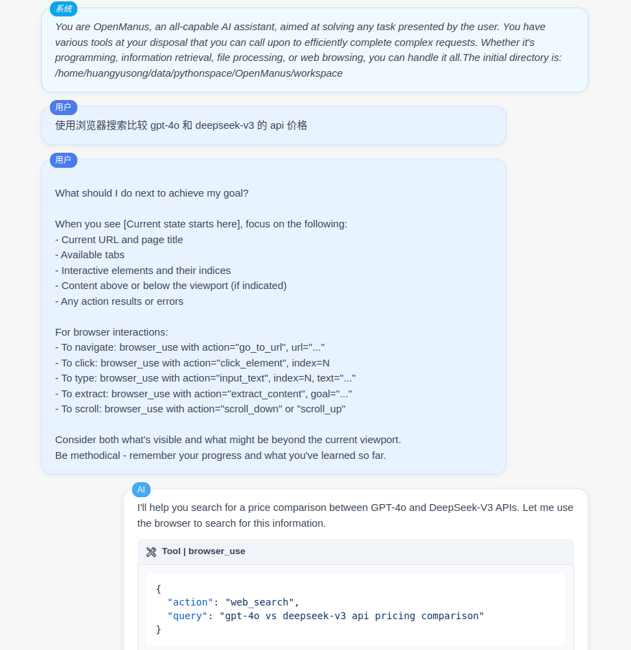

English | [中文](README)

[](https://opensource.org/licenses/MIT) &ensp;

## AI Chat HTML Exporter

A professional AI conversation history export tool that intelligently converts your AI dialogues into beautifully formatted HTML files, assisting in development debugging and prompt observation.


## ✨ Key Features

- 🚀 **Easy Integration** - Capture AI conversation logs with just one line of code
- 🔍 **Transparent Debugging** - Understand AI Agent behavior intuitively without complex langsmith configurations
- 💎 **Beautiful Display** - Responsive design, syntax highlighting, and JSON formatting
- 🌐 **Real-time Preview** - View conversation history directly in your browser
- 🛠 **Multi-framework Support** - Fully compatible with LangChain and OpenAI API
- 🎨 **Image Support** - Automatically detects base64 and URL images in conversations for seamless display

## 📋 Use Cases

- Quickly log AI conversation history during application development and debugging
- Collect and showcase AI interaction examples
- Save important AI conversations for future reference
- Share AI conversation insights with team members

## 🔧 Installation

### Install from PyPI
```bash
pip install ai-chat-html-exporter
```

### Local Development Installation
```bash
git clone https://github.com/yourusername/ai-chat-html-exporter.git
cd ai-chat-html-exporter
pip install -e .
```

## 🚀 Quick Start

### LangChain Integration Example

```python
from ai_chat_html_exporter import HtmlExportCallbackHandler
from langchain_openai import AzureChatOpenAI

# Create an exporter instance
llm = AzureChatOpenAI(
    model="gpt-4",
    callbacks=[HtmlExportCallbackHandler()]  # Just add this line
)

# The conversation logs will be automatically saved as beautifully formatted HTML files in the logs directory
```

### OpenAI API Integration Example
```python
from ai_chat_html_exporter.openai_chat_html_exporter import with_html_logger
from openai import AsyncOpenAI

@with_html_logger  # Just add this decorator
def get_openai_client(self):
    return AsyncOpenAI(api_key=self.api_key, base_url=self.base_url)
```

## ⚙️ Custom Configuration
```python
# Customize the output directory
from ai_chat_html_exporter import HtmlExportCallbackHandler
exporter = HtmlExportCallbackHandler(output_dir="my_chat_logs")
```

## 📊 Output Example



## 📦 System Requirements

- Python >= 3.7
- langchain-core >= 0.1.0
- python-dotenv >= 1.0.0
- openai >= 1.6.1

## 🔗 Related Links

- [Project Documentation](https://github.com/fishisnow/ai-chat-html-exporter)
- [Issue Tracker](https://github.com/fishisnow/ai-chat-html-exporter/issues)

---

If this project helps you, please give it a ⭐️!

